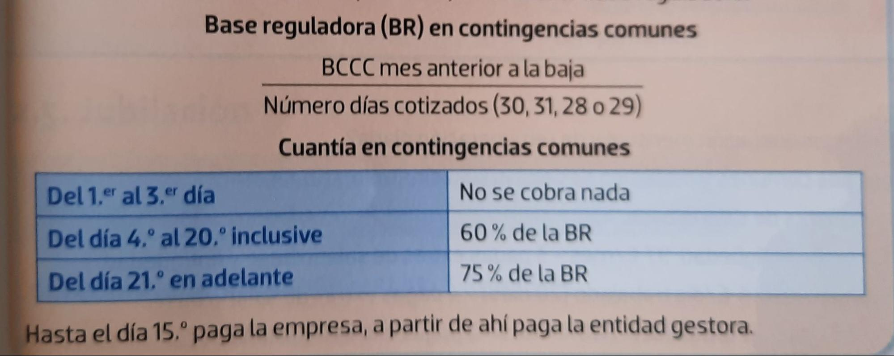
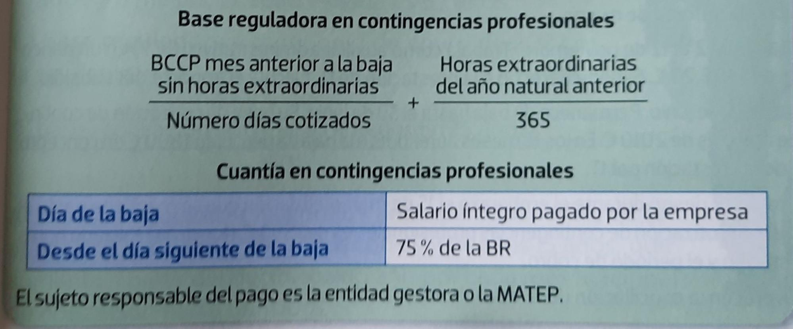
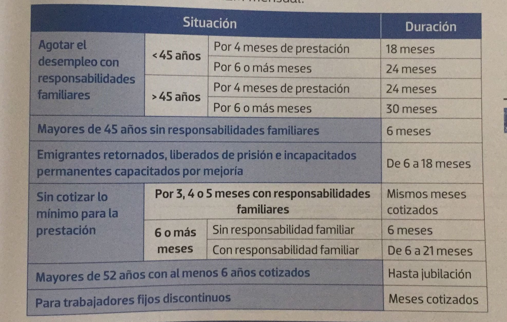

# Las prestaciones de la Seguridad Social

```cmd
===========================
Tema 4: La Seguridad Social
===========================

@author: Alejandro Pérez
```

- [Las prestaciones de la Seguridad Social](#las-prestaciones-de-la-seguridad-social)
  - [1 Asistencia sanitaria](#1-asistencia-sanitaria)
  - [2 Incapacidad temporal (IT)](#2-incapacidad-temporal-it)
    - [2.1 Contingencias Comunes - (No laborales)](#21-contingencias-comunes---no-laborales)
    - [2.1 Contingencias Profesionales - (Laborales)](#21-contingencias-profesionales---laborales)
  - [3 Desempleo](#3-desempleo)
    - [3-1 Prestación contributiva por desempleo](#3-1-prestación-contributiva-por-desempleo)
    - [3-1 Subsidio por desempleo](#3-1-subsidio-por-desempleo)

La Seguridad Social (SS) ayuda a los trabajadores con medidas económicas y no económicas (`prestaciones`) al producirse determinadas situaciones protegidas que les supone perder ingresos o unos gastos mayores.

> 🐒 Para evitar que te vayas a la mierda cuanto te ocurre un accidente *(reconocido por)* la seguridad social te echa un cable.

## 1 Asistencia sanitaria

La asistencia sanitaria incluye un conjunto de servicios médicos y farmacéuticos necesarios para conservar o restablecer la salud de sus beneficiarios.

> 🐒 Si te pones malo te curan sin tener que pagar.

## 2 Incapacidad temporal (IT)

Subsidio diario que se cobra durante la baja por enfermedad o accidente y abonado por la SS. Es hasta 1 año y medio o 2 si así lo establece un tribunal.

### 2.1 Contingencias Comunes - (No laborales)

> contingencias comunes = enfermedad común y accidente no laboral

Para cobrar tienes que:

- Estar afiliado y dado de alta en la seguridad social.
- Si es por **enfermedad común**, tener un mínimo de **180 días cotizados en los últimos 5 años**.
- Si es por **accidente no laboral**, no hace falta periodo previo de cotización.

El **subsidio** (dinero percibido) se calcula así:



El número de días cotizados depende del grupo de cotización:

- 1 al 7 siempre son 30 días.
- resto de grupos los días que tenga el mes.

Tu grupo de cotización determina el máximo y el mínimo que puedes percibir como subsidio:

> `Math.clamp(Base Reguladora, min, max);`

### 2.1 Contingencias Profesionales - (Laborales)

> contingencias profesionales = accidente de trabajo o enfermedad profesional

**No se necesita tiempo mínimo de cotización**, aunque sí es necesario estar afiliado y en alta en la seguridad social:



> Un alta presunta es no estar afiliado a la SS pero sufrir un accidente laboral.

## 3 Desempleo

La persona en situación legal de desempleo que, **pudiendo y queriendo trabajar**, pierda su empleo o reduzca su jornada laboral en, al menos, una tercera parte, puede recibir la prestación o el subsidio de desempleo.

### 3-1 Prestación contributiva por desempleo

> Lo que conocemos comúnmente como *paro*.

La prestación por desempleo la recibe quien esté en situación legal de desempleo, esté buscando activamente empleo, suscriba un compromiso de actividad y tenga al menos **360 días cotizados en los 6 años anteriores**.

Las bases de la SS están basadas en el estado de bienestar, así, el estado proporciona unos mínimos económicos a sus ciudadanos. Además, se basa en el principio de la *solidaridad intergeneracional*.


Si en el trabajo anterior no te despiden (te vas tú) y en el nuevo no pasas el periodo de prueba tienes que esperar 3 meses para cobrar el paro.

> ℹ Si se tiene derecho a 4 meses de paro, pero a los 3 se encuentra trabajo y se trabaja un año, se tiene derecho a otros 4 meses de paro. Aquí se puede elegir entre reabrir el periodo anterior (si es más interesante) o el nuevo periodo (perdiendo el anterior).

### 3-1 Subsidio por desempleo

> Si no tenemos derecho a paro *(prestación contributiva)* podemos optar al subsidio.

El subsidio por desempleo es una prestación para desempleados demandantes de empleo que no rechacen una oferta de empleo ni acciones formativas adecuadas ni tengan rentas mensuales superiores al **75% del SMI**.

La cuantía es del 80% del IPREM (indicador público de renta de efectos múltiples) mensual.


