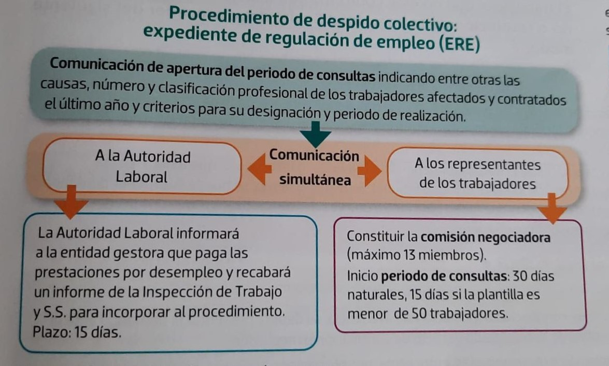

# Extinción del contrato de trabajo

```cmd
Perteneciente al:
============================================
Tema 5: Modificación, suspensión y extinción 
        del contrato de trabajo
============================================

@author: Alejandro Pérez
```

- [Extinción del contrato de trabajo](#extinción-del-contrato-de-trabajo)
  - [Despido](#despido)
    - [Despido disciplinario](#despido-disciplinario)
    - [Despido por causas objetivas](#despido-por-causas-objetivas)
    - [Despido colectivo](#despido-colectivo)
  - [Liquidación y finiquito](#liquidación-y-finiquito)
  - [Procedimiento de reclamación judicial](#procedimiento-de-reclamación-judicial)

La extinción del contrato de trabajo es la **finalización de la relación laboral** entre el empresario y la persona trabajadora, que se puede producir por:

- **Voluntad del empresario y del trabajador**:
  - Por mutuo acuerdo entre empresario y trabajador.
  - Causas válidamente consignadas en el contrato de trabajo.
    - *ej: finalización del tiempo u obra pactados.*
  - Se indemniza con **12 días / año trabajado**.
- **Voluntad del trabajador**:
  - **Dimisión**:
    - En este caso debe haber preaviso y recibirá el finiquito.
    - No se encontrará en situación legal de desempleo ni podrá cobrar el paro o ayudas.
  - **Abandono**:
    - Igual que por dimisión, no se cuenta con ayudas.
  - **Incumplimiento de las obligaciones del empresario**:
    - Se puede solicitar judicialmente el fin de contrato.
    - Indemnización de **33 días / año trabajado** con un máximo de 24 mensualidades, prorrateándose por meses los periodos inferiores al año.
  - **Modificaciones sustanciales de las condiciones de trabajo**:
    - Por movilidad funcional o geográfica..
  - Por decisión de la trabajadora **víctima de violencia de género**.
    - Hay derecho a cobrar el paro.
- **Voluntad del empresario**:
  - Ver [despido](#despido) un poco más abajo.
  - Despido disciplinario, despido por causas objetivas, despido colectivo y por fuerza mayor.

Otras causas pueden ser muerte (💀), incapacidad fuerte o jubilación de alguna de las partes. O desaparición de la figura jurídica del contratante.

## Despido

### Despido disciplinario

El despido disciplinario se produce por incumplimiento grave y culpable del trabajador, debe ir precedida de otras amonestaciones o sanciones más leves.

Si el trabajador fuera **representante legal** de los trabajadores **o delegado sindical**, antes de la carta de despido se abrirá un *expediente contradictorio* en el que serán oídos los interesados y los demás miembros de la representación a la que pertenece.

Se debe **comunicar por escrito**, indicando detalladamente los hechos que lo motivan, las fechas en que se produjeron y el día a partir del cual tendrá efecto (se puede reclamar ante juez en los 20 días hábiles posteriores, previa papeleta de conciliación).

Al trabajador se le liquidarán las retribuciones pendientes, sin derecho a indemnización.

Causas del despido disciplinario:

- **Faltas repetidas e injustificadas** de asistencia o puntualidad.
- **Indisciplina** o desobediencia relativas a las órdenes de trabajo (excepto algo denigrante o ilegal).
- **Ofensas verbales o físicas** al empresario, compañeros o a sus familiares.
- **Transgresión de la buena fe** contractual y abuso de confianza al realizar el trabajo (supone pérdida de la confianza y puede ser fichar por un compañero, robar, etc.).
- **Disminución** continuada y voluntaria **del rendimiento de trabajo**.
- **Embriaguez** habitual o **toxicomanía** si repercuten negativamente en el trabajo.
- El **acoso** por razón de origen racial o étnico, religión o convicciones, discapacidad, edad u orientación sexual y el acoso sexual o por razón de sexo al empresario o a las personas que trabajan en la empresa.

### Despido por causas objetivas

Se produce por:

- **Ineptitud** del trabajador.
- **Falta de adaptación** del trabajador a modificaciones técnicas del puesto de trabajo.
  - Tras pasar 2 o más meses desde su introducción o finalizar la formación ofrecida por la empresa.
- No te pueden pagar:
  - **Amortización de puestos de trabajo** cuando existan causas ETOP en número inferior al despido colectivo.
  - **Falta de presupuesto público** para ejecutar planes y programas públicos.

Se comunica por escrito **15 días antes**, indicando la causa del despido, y se ofrece una indemnización de **20 días / año trabajado**, prorrateándose por meses los periodos inferiores al año, con un máximo de 12 mensualidades.

> En esos 15 días se tiene licencia de **6 horas semanales** para buscar otro trabajo.

### Despido colectivo

En el despido colectivo existen causas **ETOP** que lo justifican y afectan a un número importante de trabajadores.



El periodo de consultas puede cerrarse:

- **Sin acuerdo**:
  - Se debe comunicar el despido y sus condiciones a los representantes y notificarlo individualmente a los afectados.
  - Puede impugnarse individual y colectivamente.
- **Con acuerdo**:
  - La Autoridad Laboral puede impugnarlo.

Se percibe una indemnización de 20 días de salario por año trabajado, prorrateándose por meses los periodos inferiores al año, con un máximo de 12 mensualidades.

## Liquidación y finiquito

Cuando se extingue un contrato, la empresa te tiene que dar un finiquito  con la propuesta de liquidación y la documentación necesaria para solicitar la prestación de desempleo.

- **Liquidación**:
  - Documento que presenta la empresa al trabajador a la fecha de cese con una propuesta de las cantidades pendientes de pago hasta ese momento.
- **Finiquito**:
  - Documento por el que se formaliza la ruptura del vínculo laboral.
  - Contiene una declaración de voluntad del trabajador, que expresa su conformidad con la extinción de la relación laboral y con la cantidad saldada.
  - El trabajador podrá solicitar la presencia de un representante legal de los trabajadores en el momento de proceder a la firma del recibo del finiquito, haciéndose constar en el mismo.
  - Se puede impugnar y reclamar incluso después de firmado.
    - El plazo para su impugnación es de 1 año y se puede acumular a la acción de despido.

En la liquidación se indican solo cantidades. En el finiquito se indican además la declaración de su abono y de la extinción de la relación laboral.

---

Conceptos que debe incluir un finiquito:

- **Devengos**:
  - Salarios del mes.
  - Parte proporcional de una o de las dos pagas extras (según el devengo sea semestral o anual).
  - Días de vacaciones no disfrutados.
  - Indemnización según tipo de despido.
  - Periodo de preaviso no cumplido.
- **Deducciones**:
  - Cotizaciones a la SS.
  - Retenciones por IRPF.

## Procedimiento de reclamación judicial

El trabajador que no esté conforme con alguna decisión del empresario o resolución de la SS debe proceder del siguiente modo:

- **Acto de conciliación previa**:
  - La solicitud la realiza el propio trabajador ante el órgano de la comunidad autónoma encargado de la medición, el arbitraje y la conciliación.
  - En los despidos, el plazo de reclamación es de **20 días hábiles** desde que se produce el hecho causante.
  - En el acto de mediación o conciliación, la empresa y el trabajador deben intentar llegar a un acuerdo, que tendrá fuerza ejecutiva entre las partes sin necesidad de ratificación ante el juez o tribunal.
  - Si no hay acuerdo, se puede interponer demanda en el juzgado de lo Social.
- **Demanda y juicio oral**:
  - Una vez celebrado o intentado el acto de conciliación o mediación sin avenencia, se deberá presentar la demanda ante el juzgado de lo Social, aportando el justificante del resultado del acto de conciliación o mediación.
  - Las partes pueden comparecer por sí mismas o representadas.
  - Antes de comenzar el juicio oral, el secretario judicial intentará una nueva conciliación entre las partes.
- **Sentencia y recursos**:
  - El juzgado de lo Social dictará sentencia **en el plazo de 5 días**, en la que calificará el despido como nulo, improcedente o procedente, notificándose a las partes dentro de los 2 días siguientes.
  - La sentencia ha de indicar si es firme o no, y en este caso los recursos que proceden, órgano ante el que han de interponerse, plazo, requisitos y depósitos, y las consignaciones que sean necesarias, así como la forma de efectuarlos.

Tras el proceso anterior, el juez puede calificar el despido de una de las siguientes maneras:

- **Procedente**:
  - Cuando se demuestra que las causas de despido son justificadas.
- **Improcedente**:
  - No quedan demostrados los motivos alegados por el empresario en el despido.
  - En el caso del despido disciplinario, si no se han cumplido los requisitos de forma.
  - El empresario podrá optar entre:
    - Abonar una indemnización de **33 días / trabajado** con un máximo de 24 mensualidades.
    - Readmitir al trabajador, abonándole los salarios de tramitación desde la fecha del despido hasta la fecha de notificación de la sentencia.
  - Si el trabajador era representante de los trabajadores él decide si le readmiten o le indemnizan.
- **Nulo**:
  - Será nulo el despido que tenga como móvil algunas de las causas de discriminación prevista en la Constitución y en la ley, o se produzca con violación de derechos fundamentales y libertades públicas del trabajador.
  - El empresario debe readmitir al trabajador y abonarle los salarios de tramitación desde la fecha de despido hasta la fecha de notificación de la sentencia.

Será también nulo el despido:

- Durante suspensión por nacimiento o cuidado de un menor.
- De trabajadoras embarazadas.
- En excedencia solicitada por parto prematuro u hospitalización tras el parto.
- De trabajadoras víctimas de violencia de género.
- En los 12 meses tras el nacimiento o adopción / acogimiento de un menor.

---
> Go back to the  [index](Tema-05.md).
