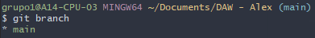
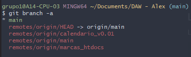

# Git Branching

```cmd
@author: Alejandro Pérez
```

- [Git Branching](#git-branching)
  - [Listing branches](#listing-branches)
  - [Creating branches](#creating-branches)
  - [Deleting branches](#deleting-branches)
  - [Renaming branches](#renaming-branches)
  - [Moving between branches](#moving-between-branches)
  - [Merging](#merging)
  - [Local and remote](#local-and-remote)


These are the commands we'll use when working with branches:

| Command        | Use                         |
| -------------- | --------------------------- |
| `git branch`   | Create and delete branches. |
| `git checkout` | Move between branches.      |
| `git merge`    | Join branches.              |

## Listing branches

Lists all **local** branches:

```bash
git branch
```



Lists all branches:

```bash
git branch -a
```



## Creating branches

Creates a branch:

```bash
git branch <branch-name>
```

Creates and **moves** you to the branch:

```bash
git checkout -b <branch-name>
```

## Deleting branches

Safe option, it won't work if the branch has unmerged work.

```bash
git branch -d <branch-name> # Safe
```

Will delete the branch no matter what:

```bash
git branch -D <branch-name> # "Force" delete
```

## Renaming branches

Renames the current branch:

```bash
git branch -m <new-branch-name>
```

## Moving between branches

```bash
git checkout <branch-name>
```

## Merging

## Local and remote
