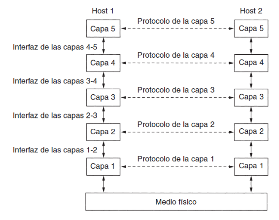
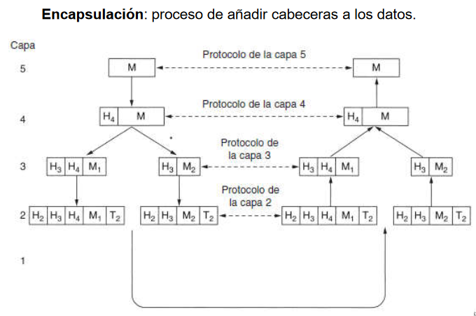
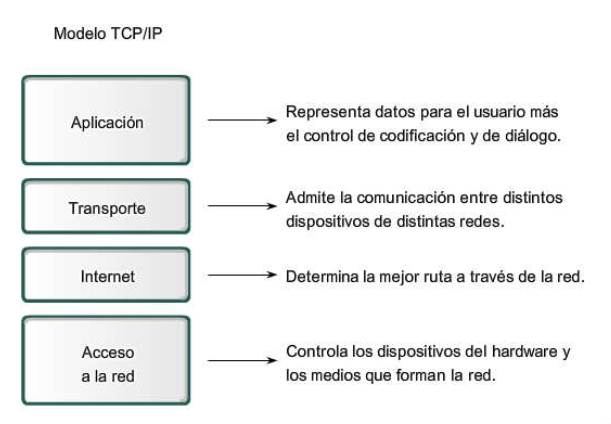

# Introducción a las arquitecturas de redes

``` cmd
@author: Alejandro Pérez
```

- [Introducción a las arquitecturas de redes](#introducción-a-las-arquitecturas-de-redes)
- [Introducción](#introducción)
  - [Elementos de una red](#elementos-de-una-red)
  - [Problemas en el diseño de la arquitectura](#problemas-en-el-diseño-de-la-arquitectura)
  - [Arquitectura por capas o niveles](#arquitectura-por-capas-o-niveles)
  - [Características de la arquitectura por niveles](#características-de-la-arquitectura-por-niveles)
- [Modelos de referencia](#modelos-de-referencia)
  - [Modelo OSI](#modelo-osi)
  - [Arquitectura TCP/IP](#arquitectura-tcpip)
- [Otras arquitecturas](#otras-arquitecturas)
  - [Red Microsoft](#red-microsoft)
  - [Red ATM](#red-atm)

# Introducción

La **arquitectura de una red** es una serie de esquemas conceptuales sobre los que se construye una red física. Está formada por un conjunto de capas y protocolos

Viene definida por:

- Topología
- Método de acceso a la red
- Protocolos de comunicaciones

## Elementos de una red

En una red de comunicaciones encontramos dos aspectos fundamentales:

- El Hardware
  - Los dispositivos físicos de la red.
- El Software
  - Los programas informáticos que controlan las comunicaciones.
  - Es el conjunto de programas encargado de gestionar la red, controlar su uso, realizar detección y corrección de errores, etc.
  - Realiza sobre el hardware de la red una función equivalente a la del sistema operativo sobre la máquina

## Problemas en el diseño de la arquitectura

A la hora de diseñar una arquitectura de red hay que tener en cuenta una serie de problemáticas:

- **Encaminamiento**
  - Elección de la mejor ruta para ir de origen a destino.
- **Direccionamiento**
  - Mecanismo para que un proceso en una máquina especifique con quién quiere comunicarse.
- **Acceso al medio**
  - Control del orden de transmisión de los interlocutores.
- **Saturación del receptor**
  - Un emisor rápido puede saturar a un receptor lento y bloquear parte de la red.
- **Mantenimiento del orden**
  - Volver a ordenar los mensajes en el destino.
- **Control de errores**
  - Detectar y corregir errores.
- **Multiplexación**
  - Asegurar que todas las comunicaciones que comparten el mismo medio no se interfieran entre sí.

## Arquitectura por capas o niveles

Para reducir la complejidad del diseño de una arquitectura, las redes ser organizar en **capas** o **niveles**. El nº de capas varía de red en red y estas son *"independientes"* entre sí (se hablan pero no necesitan saber como hacen las cosas).

> ℹ Cada capa se construye a partir de la que viene por debajo de ella y van subiendo en nivel de abstracción del medio físico.

Las capas de dos máquinas distintas se hablan de *n* a *n*. Es decir, la capa 4 de la máquina 1 habla con la capa 4 de la máquina 2. Las entidades que actúan en dos capas iguales se llaman **pares** o **peers**.



Un **protocolo** es un acuerdo entre peers sobre como se debe de llevar a cabo la comunicación.

> 📝 Dos *peers* no pueden hablar de forma directa entre sí, tienen que hacerlo pasando por todas las capas intermedias y el medio físico.

Entre dos capas adyacentes hay una **interfaz**, esta determina que operaciones y servicios deja disponibles una capa a la otra. Cada uno de los niveles le ofrece servicios al nivel superior.

## Características de la arquitectura por niveles

Ventajas de la utilización de un modelo en capas son:

- Ayuda en el diseño de protocolos.
- Promueve la competencia.
- Permite que los cambios en una capa no afecten las capas restantes.
- Proporciona un lenguaje común.

Al trabajar por niveles, cada nivel le añade al mensaje original una **cabecera** para que su peer pueda descifrarlo. Estas cabeceras se van acumulando mientras nos acercamos al medio físico y la máquina receptora las va quitando según pasa por sus capas.



Para acceder a los servicios de una capa, la capa superior usa un **SAP** (Service Access Point).

Los servicios están relacionados con las interacciones entre capas. Los protocolos están relacionados con los paquetes enviados entre entidades
iguales de máquinas diferentes.

- **Servicio**: conjunto de primitivas (operaciones) que una capa proporciona a la capa que está sobre ella.
  - Define qué operaciones puede realizar la capa en beneficio de sus usuarios, pero no indica cómo se implementan tales operaciones.
  - Está relacionado con la interfaz entre dos capas, donde la capa inferior es la que provee el servicio y la superior, quien lo recibe.
- **Protocolo**: conjunto de reglas que rigen el formato y el significado de los paquetes, o mensajes, que se intercambian las entidades iguales en una capa.
  - Las entidades utilizan protocolos para implementar sus definiciones del servicio.
  - Pueden cambiar sus protocolos cuando lo deseen, siempre y cuando no cambie el servicio visible a sus usuarios. Por eso, el servicio y el protocolo no dependen uno del otro.

# Modelos de referencia

## Modelo OSI

Está basado en una propuesta de 1983 de la ISO como primer paso a una estandarización internacional de los protocolos y fue revisado en el 95.

> Es un **modelo teórico**, no una arquitectura real ya que se definió unicamente la función que debe de realizar la capa pero no sus servicios o protocolos.

El modelo OSI (Open Systems Interconnection) consta de 7 capas:

- **Físico**
  - nivel de bit, define las características físicas del medio de transmisión
  - *Ej. Hubs Ethernet, modems, conmutadores de circuitos, ...*
- **Enlace**
  - establece una línea de comunicación libre de errores entre nodos adyacentes de la red
  - *Ej. tarjetas de red, switches, ...*
- **Red**
  - encamina los mensajes desde un origen a un destino a través de los nodos de la red por el camino más adecuado
  - fragmenta los paquetes en caso necesario
- **Transporte**
  - controla el flujo extremo-a-extremo entre dos hosts y se encarga de que los datos lleguen ordenados y sin perdidas, errores o duplicados a su destino
- **Sesión**
  - establece, mantiene y termina el diálogo entre los hosts
  - sincroniza la transferencia
- **Presentación**
  - compatibiliza arquitecturas con estructura de datos diferentes
  - se encarga de la encriptación y compresión de los datos
- **Aplicación**
  - en contacto directo con los programas o aplicaciones del host

---

**Problemas del modelo OSI:**

- Aparición inoportuna.
  - Los protocolos TCP/IP ya eran ampliamente utilizados cuando aparecieron los
protocolos OSI.
- Mala **tecnología**:
  - Tanto el modelo como los protocolos tienen defectos. 
  - La elección de las siete capas fue más política que técnica, y dos de las capas (la 5 y la 6) están casi vacías, mientras que otras dos (la 2 y la 3) están saturadas.
  - Algunas funciones, como direccionamiento, control de flujo y control de errores, aparecen una y otra vez en cada capa.
- Malas **implementaciones**:
  - Ante la enorme complejidad del modelo y los protocolos las implementaciones iniciales eran grandes, pesadas y lentas.
- Malas **políticas**:
  - Se pensaba que OSI sería implantada en Europa y más tarde en los Estados Unidos, pero la idea de los burócratas gubernamentales intentando poner en marcha un estándar técnicamente inferior no ayudó.

## Arquitectura TCP/IP

Es la más utilizada en el mundo y la base de comunicación de internet.

Es el resultado de las investigaciones iniciadas en 1973 por el Departamento de Defensa de Estados Unidos para desarrollar una red de comunicación que cumpliera las siguientes características:

- Permitir **interconectar redes diferentes**:
  - Esto quiere decir que la red
en general puede estar formada por tramos que usan tecnología de
transmisión diferente.
- Sea **tolerante a fallos**:
  - El DoD deseaba una red que fuera capaz de
soportar ataques terroristas o incluso alguna guerra nuclear sin
perder datos y manteniendo las comunicaciones establecidas.
- Permitir el **uso de aplicaciones diferentes**:
  - transferencia de archivos,
comunicación en tiempo real, etc.

Es independiente de los fabricantes y marcas comerciales, puede funcionar en máquinas de cualquier tamaño y puede conectar redes de diferentes tecnologías.

---

Tiene 4 capas:



- **Acceso a red**:
  - Protocolo que conecte la estación a la red.
  - Esta capa depende de la tecnología utilizada y no se especifica de antemano.
- **Internet**:
  - La más importante, permite que las estaciones envíen paquetes a la red y los hagan viajar de forma independiente a su destino.
  - No se responsabiliza de reorganizar los paquetes en el destino.
- **Transporte**:
  - Establece una conversación entre el origen y el destino (similar a la capa transporte del OSI).
  - Se encarga del control de errores y ordenación de los mensajes, destacan dos protocolos:
    - **TCP** (Transmission Control Protocol)
    - **UDP** (Used Datagram Protocol)
- **Aplicación**
  - Contiene los protocolos de alto nivel que utilizan los programas para comunicarse.

# Otras arquitecturas

## Red Microsoft

La arquitectura de red de Microsoft está diseñada para permitir la coexistencia e integración con otras arquitecturas como TCP/IP o Novell.

## Red ATM

Capas de la arquitectura ATM

- **Física**:
  - relacionada directamente con la red y el medio de transmisión.
- **ATM**:
  - controla el transporte y el camino que siguen los paquetes para evitar congestión
- **Adaptación ATM**:
  - es la encargada de dividir toda la información que se va a transmitir en celdas y re-ensamblarla en el otro extremo

---

> Go back to the [index](.index.md#index).
