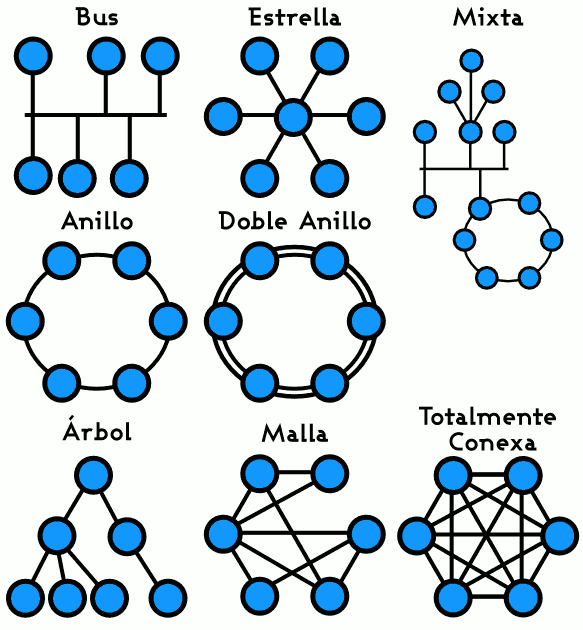

# Introducción a los sistemas de comunicación

``` cmd
@author: Alejandro Pérez
```

- [Introducción a los sistemas de comunicación](#introducción-a-los-sistemas-de-comunicación)
- [Definiciones](#definiciones)
  - [Información](#información)
  - [Sistema Informático](#sistema-informático)
  - [Telecomunicación](#telecomunicación)
  - [Red de Transmisión](#red-de-transmisión)
  - [Red de comunicación](#red-de-comunicación)
  - [Red de computadoras](#red-de-computadoras)
- [Sistemas de numeración](#sistemas-de-numeración)
  - [Decimal](#decimal)
  - [Binario](#binario)
  - [Hexadecimal](#hexadecimal)
  - [Hexadecimal a Binario y viceversa](#hexadecimal-a-binario-y-viceversa)
- [Comunicación de datos](#comunicación-de-datos)
  - [Partes de una red de comunicación](#partes-de-una-red-de-comunicación)
  - [Servicios y Protocolos](#servicios-y-protocolos)
  - [Clasificación de las redes](#clasificación-de-las-redes)
    - [Titularidad de la red](#titularidad-de-la-red)
    - [Topología](#topología)
    - [Transferencia de la información](#transferencia-de-la-información)
    - [Localización Geográfica](#localización-geográfica)
  - [Normalización](#normalización)

# Definiciones

## Información

Todo aquello que produce un aumento de nuestros conocimientos.

## Sistema Informático

Realiza algún tipo de tratamiento de la información

## Telecomunicación

Esta es la definición oficial:

> Toda transmisión, emisión o recepción de signos, señales, imágenes, sonidos o informaciones de cualquier tipo que se transmiten por hilos, medios ópticos, radioeléctricos u otros sistemas electromagnéticos.

Viene a ser la emisión o recepción de cualquier cosa por medios tecnológicos. 🐵

## Red de Transmisión

Estructura formada por medios físicos (dispositivos reales) y lógicos (programas de
transmisión y control) para satisfacer las necesidades de comunicación de una determinada zona geográfica.

## Red de comunicación

> Señal recibida = Señal enviada + *Ruido*

Los elementos de una red de comunicación son los sistemas de:

- **Transmisión**: transporta las señales por la red
- **Conmutación**: encamina la información hacia su destino
- **Señalización**: separa y sincroniza los recursos que están en la red

## Red de computadoras

Conjunto de ordenadores que poseen dos características:

- Están interconectados mediante algún medio de transmisión.
  - Pueden intercambiar información
- Son autónomas:
  - Pueden procesar de datos
  - No están controlados por un ordenador central

# Sistemas de numeración

Los sistemas de numeración pueden ser :

- **aditivos**: en ellos se suman los símbolos que representan cada
cantidad y no es relevante el orden en el que aparezcan (como el
sistema egipcio).
- **híbridos**: donde se multiplican los símbolos antes de sumarlos (como
el sistema chino).

Los sistemas de numeración más utilizados son los posicionales.
Un sistema posicional posee las siguientes características:

- Emplea un número finito de símbolos, dígitos o cifras: la base del sistema.
- Una cantidad es una secuencia finita de símbolos del sistema.
- La cantidad total expresada se obtiene sumando el valor de los símbolos.
- El valor de cada símbolo depende de sí mismo y de la posición que ocupa

## Decimal

Es el empleado por la mayoría de las civilizaciones, y el más utilizado actualmente en todo el mundo.

- Fue tomado de los hindúes por los árabes en el siglo VIII.
- Su base es 10 -> tiene 10 símbolos diferentes `{0,1,2,3,4,5,6,7,8,9}`
- Es un sistema posicional.

## Binario

Fue introducido por Leibniz en el siglo XVII.

- Es el que utilizan las máquinas electrónicas digitales.
- Su base es 2 -> tiene 2 símbolos diferentes : `{0,1}`
- Es un sistema posicional.

## Hexadecimal

- La base de este sistema es 16, y lo símbolos que utiliza son: `{0,1,2,3,4,5,6,7,8,9,A,B,C,D,E,F}`
- Es un sistema posicional.

## Hexadecimal a Binario y viceversa

La conversión de Hexadecimal a Binario es directa, cogemos cada carácter en hexadecimal y lo escribimos en binario. Para hacer la conversión inversa agrupamos de 4 en 4 los nº binarios empezando por la derecha y los escribimos en hexadecimal.

> En octal es de 3 en 3.

# Comunicación de datos

## Partes de una red de comunicación

Terminales o Dispositivos finales:

- Determinan la naturaleza de la información (voz, datos, etc), son: ordenadores, teléfonos, etc.

Dispositivos de red:

- Comunican emisor con receptor.
  - **Canal de comunicación**: medio por el que circula la información.
  - **Elementos de interconexión**: interconectan los terminales y buscan
el mejor camino
  - **Adaptadores de red**: convierten el formato de la información de los
terminales al formato de la red

Programas de red:

- Controlan el funcionamiento de la red

## Servicios y Protocolos

**Servicios**: funcionalidades que ofrece la red de comunicación:

- transmisión de voz,
- transmisión de datos
- Establecimiento de comunicación

**Protocolo de red**: normas que se han de seguir para realizar la transmisión de la información:

- Velocidad de la transmisión
- Tipo de información
- Formato de los mensajes.

## Clasificación de las redes

Se pueden clasificar de 1000 formas distintas, pero estos son los cuatro (4) principales criterios:

### Titularidad de la red

> Quien es el propietario de la red. 🤔

Tenemos dos tipos de redes, las dedicadas o privadas y las compartidas:

- **Redes dedicadas**
  - Diseñadas e instaladas por el usuario o alquiladas a compañías de comunicaciones externas. <br> *Ej. Redes locales del instituto.*
- **Redes compartidas**
  - Redes de servicio público alquiladas a compañías de comunicaciones. Se trata de redes conmutadas y redes de transmisión de datos. <br> *Ej. Red de telefonía fija, de telefonía móvil, de fibra óptica, etc.*

### Topología

"Forma" que tiene la red. Hay varios tipos:



> Hay que notar que la que en la imagen es llamada de *"malla"* en los apuntes es llamada *"irregular"*. De la misma forma, la llamada *"totalmente conexa"* es la que llaman *"malla"*.
> > He buscado varias imágenes para ilustrar este concepto pero todas tienen la misma terminología, por lo que imagino que los apuntes estarán raros.

Cada una de las topologías tienes sus ventajas e inconvenientes en cuanto a coste y velocidad de transmisión de los mensajes. A la hora de la verdad casi todas las redes son mixtas o de estrella.

### Transferencia de la información

Según la forma que tengan de comunicarse los distintos equipos entre ellos.

Comunicación **punto a punto** (redes conmutadas). La conmutación puede ser realizada a distintos niveles:

- Conmutación de **circuitos**
  - Durante el proceso de comunicación del emisor con el receptor se establece un camino único dedicado. Al terminar la comunicación se libera la conexión. <br> *Ej. Llamada telefónica.*
- Conmutación de **paquetes**
  - El mensaje se divide en partes (paquetes) que circulan por la red hasta llegar al destino donde se juntan formando el mensaje original.
  - Cada paquete puede seguir un camino distinto según la saturación de la red.
- Conmutación de **mensajes**
  - La información va en un sólo mensaje que va pasando de un nodo al siguiente, si el camino está libre, hasta llegar al destino


---

Comunicación **multi-punto** (redes de difusión)

- Un equipo envía la información a todos los nodos, y el destinatario es el encargado de capturar esa información.
- Solo se dispone de un único camino compartido por todos los nodos: topología en bus o anillo.
- Es el más utilizado en redes de tamaño


### Localización Geográfica

Según el alcance que tenga la red. Se dividen en:

- Subred
  - *Ej. Departamento de una empresa; un aula de informática; etc.*
- Red de área local (LAN)
  - *Ej. Red de una planta; de un edificio; etc.*
- Red de campus
  - Se extiende entre varios edificios dentro de un mismo recinto.
  <br> *Ej. Red de un polígono industrial.*
- Red de área metropolitana (MAN)
  - Se extiende por una ciudad y está sujeta a regulaciones locales.
  <br> *Ej. Red de TV por cable.*
- Red de área extensa (WAN)
  - Abarcan varias ciudades, regiones o países.

## Normalización

Las normas se dividen en dos categorías:

- **De facto** (de hecho):
  - estándares que simplemente aparecieron y se impusieron en el mercado por su extensa utilización.
  <br> *Ej: el ordenador personal (PC) de IBM y sus sucesores.*
  <br> *Ej: el sistema operativo UNIX.*
- **De jure** (de ley):
  - estándares formales y legales acordados por algún organismo de estandarización autorizado.

---

> Go back to the [index](.index.md#index).
