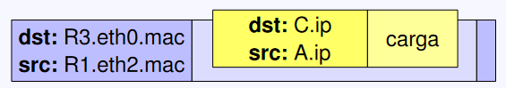

# Packet Transfer

- [Packet Transfer](#packet-transfer)
  - [TLDR](#tldr)
  - [Cosas que tenemos que saber](#cosas-que-tenemos-que-saber)
    - [Paquetes](#paquetes)
    - [Tabla de enrutamiento](#tabla-de-enrutamiento)
    - [Peticiones ARP](#peticiones-arp)
    - [Envío de  paquetes](#envío-de--paquetes)
  - [Ejemplo Simple](#ejemplo-simple)
  - [Ejemplo Complejo](#ejemplo-complejo)

Vamos a trabajar con esta red de ejemplo:

## TLDR

Para poder enviar un mensaje entre dos equipos necesitamos saber las mac respectivas. La primera parte de la conexión siempre es descubrir la mac de destino.

Vamos a ir preguntando (*ARP*) por el host de destino hasta que este nos conteste con su dirección. Una vez la tengamos la comunicación puede iniciarse.

Si no obtenemos respuesta a la pregunta, reenviamos el mensaje por el default.

> Cada vez que queremos mandarle algo a alguien, aunque sea un intermediario, tenemos que conseguir su mac.

## Cosas que tenemos que saber

### Paquetes

Tienen las ip de destino y de origen más la carga del mensaje.

### Tabla de enrutamiento

| destino       | máscara        | next hop      | iface             |
| ------------- | -------------- | ------------- | ----------------- |
| ip de destino | máscara de red | ip del router | puerto del router |

> Si no hay router intermediario, el next hop es ***directo***

> El destino ***default*** es aquel al que vamos si no encontramos el host que buscamos a partir de la tabla.

### Peticiones ARP

ARP permite hacer peticiones y respuestas para obtener la dirección física de un host.

La pregunta se hace con destino broadcast y la respuesta va dirigida a la mac que hizo la pregunta.

> para hacer la pregunta enviamos `00::00` en el campo a preguntar

### Envío de  paquetes

El orden de la ristra de nombres de *dst* y *src* es:

- nombre del **host**
- **puerto**
- **mac** o **ip**

## Ejemplo Simple

- A **construye el paquete** que quiere enviar:

  

- Buscamos a B:
  - Consulta a la **tabla de enrutamiento**:
  
    

    El destino *default* es adonde mandamos nuestro paquete si no encontramos otro destino.
  - **Petición ARP** para encontrar a B dentro de la misma red:

     

     El primer paso siempre es buscar el destino dentro de la propia red. Para ello hacemos un broadcast.

     El `00::00` es una pregunta, le estamos pidiendo a B que rellene con su mac.
- B contesta con **respuesta ARP**:

  

  B responde ya de forma directa a A con su mac.

- Se envía el paquete:

    

## Ejemplo Complejo

- A **construye el paquete** que quiere enviar *(igual que en el simple)*.
- Buscamos C:
  - A consulta su tabla de enrutamiento:

    
  
    Igual en el 1er ejemplo, A pregunta dentro de su red por C. Al no obtener respuesta le pregunta a default.
  - A obtiene la mac de R1 (router conectado a A) con ARP.
  - Se le envía el paquete a R1:

    

    El destino es el **puerto** eth0 **router** R1.
    > Como siempre, para enviar el paquete lo hacemos con la mac.
  - R1 extrae el paquete.
  - R1 consulta su tabla:

    

    Aplicando la máscara de red a la ip de C, R1 determina a quien le tiene que enviar el mensaje.

  - R1 averigua por ARP la mac de R3 y le reenvía el mensaje.
  
    
  - R3 consulta su tabla y pregunta por C
- Una vez encontrado C:
  - R3 obtiene la mac de C con ARP
  - R3 le encapsula el paquete y se lo envía a C
  - C contesta a A con su mac

---

> Go back to the [index](.index.md#index).
