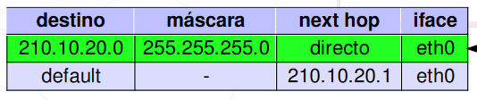
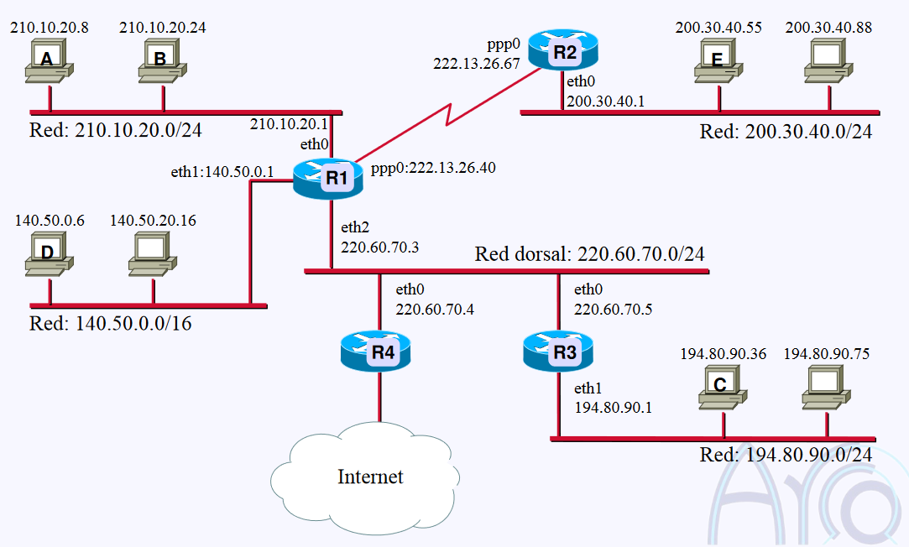
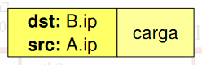
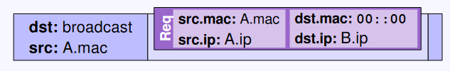
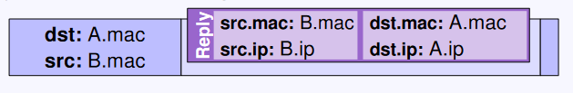
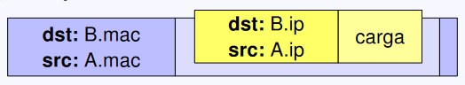
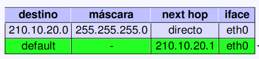
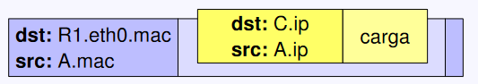
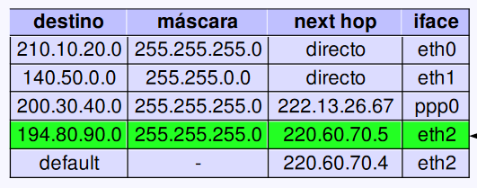

# Packet Transfer

- [Packet Transfer](#packet-transfer)
  - [Simple](#simple)
  - [Complejo](#complejo)

Necesitamos:

- saber construir tabla de enrutamiento

    

    | destino       | máscara        | next hop                         | iface                               |
    | ------------- | -------------- | -------------------------------- | ----------------------------------- |
    | ip de destino | máscara de red | ip con la que nos conecta        | puerto del route al que nos conecta |
    |               |                | directo si no hay intermediarios |                                     |

Para poder enviar un mensaje entre dos equipos necesitamos saber las mac respectivas. La primera parte de la conexión siempre es descubrir la mac de destino. Para ello vamos a ir preguntando por el host de destino hasta que este nos conteste con su dirección. Una vez la tengamos la comunicación puede iniciarse.

Vamos a trabajar con esta red de ejemplo:

## Simple

- A **construye el paquete** que quiere enviar:

  

- Buscamos a B:
  - Consulta a la **tabla de enrutamiento**:
  
    

    El destino *default* es adonde mandamos nuestro paquete si no encontramos otro destino.
  - **Petición ARP** para encontrar a B dentro de la misma red:

     

     El primer paso siempre es buscar el destino dentro de la propia red. Para ello hacemos un broadcast.

     El `00::00` es una pregunta, le estamos pidiendo a B que rellene con su mac.
- B contesta con **respuesta ARP**:

  

  B responde ya de forma directa a A con su mac.

- Se envía el paquete:

    

## Complejo

- A **construye el paquete** que quiere enviar *(igual que en el simple)*.
- Buscamos C:
  - A consulta su tabla de enrutamiento:

    
  - A obtiene la mac de R1 (router conectado a A) con ARP.
  - Se le envía el paquete a R1:

    

    El destino es el **puerto** eth0 **router** R1.
    > Como siempre, para enviar el paquete lo hacemos con la mac.
  - R1 extrae el paquete.
  - R1 consulta su tabla:

    

  - R1 averigua por ARP la mac de R3 y le reenvía el mensaje.