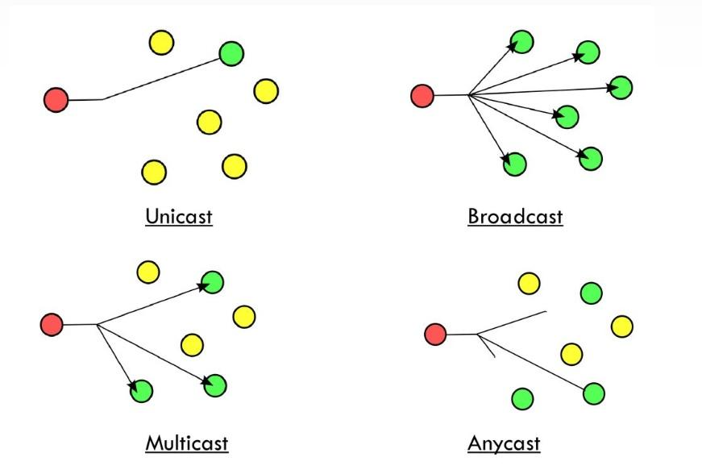
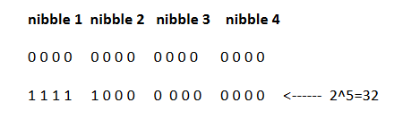

# Subnetting IPV6

``` cmd
@author: Alejandro Pérez
```

- [Subnetting IPV6](#subnetting-ipv6)
  - [Tipos de direcciones IPv6](#tipos-de-direcciones-ipv6)
  - [Direcciones Unicast](#direcciones-unicast)
    - [Dirección de loopback](#dirección-de-loopback)
    - [Dirección sin especificar](#dirección-sin-especificar)
  - [IPv4 a IPv6](#ipv4-a-ipv6)
  - [Subnetting](#subnetting)

La ipv6 (Internet Protocol version 6) fue diseñada para sustituir a la ipv4, que ya se estaba quedando corta por número de direcciones posibles.

> - la ipv4 permite 2^32 direcciones de host
> - la ipv6 permite 2^128 direcciones de host, unas pocas más, como quien dice

Las direcciones IPv6 se expresan en [hexadecimal](intro-sistemas-comunicacion.md#hexadecimal) y consta de 8 hextetos o bloques de 16 bits.

Ejemplo de ipv6:

- `2001:BBBB:0000:1118:0000:0000:0000:0A00`
- `2001:BBBB:0:1118::A00`
  - se pueden omitir los zeros a la izquierda: `0A00 -> A00`
  - si tenemos cuatro zeros podemos dejar solo uno: `0000 -> 0`
  - podemos omitir un único grupo de hextetos nulos con `::`

## Tipos de direcciones IPv6

- **Unicast**
  - representan a un único dispositivo
- **Multicast**
  - representan a un grupo de dispositivos
  - empiezan con: `FFxx::/8`
- **Anycast**
  - representan a un grupo de dispositivos
  - son como una multicast con una diferencia, cuando recibe un paquete en vez de recibirlo todos los host lo recibe únicamente el más cercano



## Direcciones Unicast

Pueden ser:

- **globales**, parecidas a una red pública IPv4
- **locales**, lo mismo que una red local IPv4, únicamente se pueden comunicar con otros dispositivos dentro de la red local

Se estructuran con o están partidas en:

- prefijo de **enrutamiento**:
  - la dirección de red de base
  - compuesta por los primeros 48 bits o 3 hextetos.
- identificador de **subred**:
  - particiones de la red de base realizadas para subnetting
  - compuesta por los siguientes 16 bit o 1 hextetos
- identificador de **host**
  - últimos 64 bit o 4 hextetos

> un hexteto está compuesto por 4 nibble!

### Dirección de loopback

::1

### Dirección sin especificar

::

## IPv4 a IPv6

No tenemos más que traducir al hexadecimal los números de la IP. Añadimos una cabecera de `::ffff` y listo.

Así la dirección `192.168.0.32` pasa a ser `::ffff:C0A8:20`.

> Cada octeto de la IPv4 corresponde a dos cifras en hexadecimal

## Subnetting

No hace falta reservar ninguna dirección para broadcast o máscara de red.

Para hacer el subnetting, igual que en IPv4 calculamos cuantas subredes necesitamos y ajustamos el nº de bits necesarios.

En IPv6, por simplificar y por el número tan loco de redes que nos ofrece, nunca vamos a cortar un nibble por la mitad. Esto quiere decir que si queremos 20 subredes y necesitamos 5 bits, vamos a coger 8 (2 nibble).

